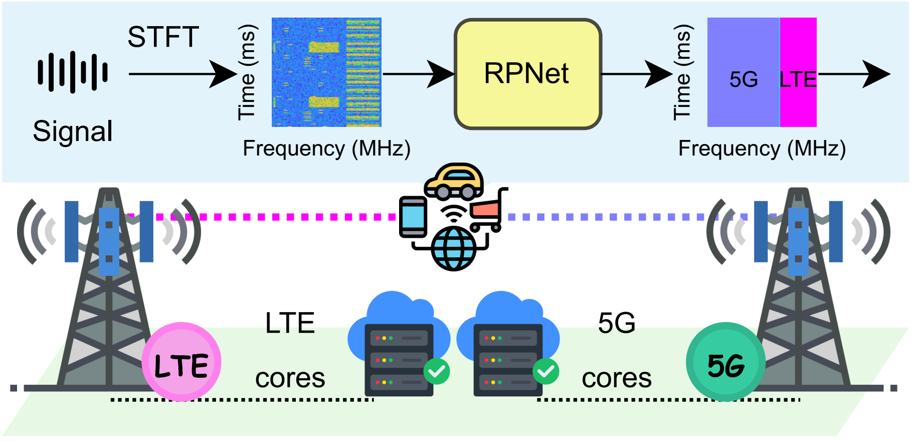
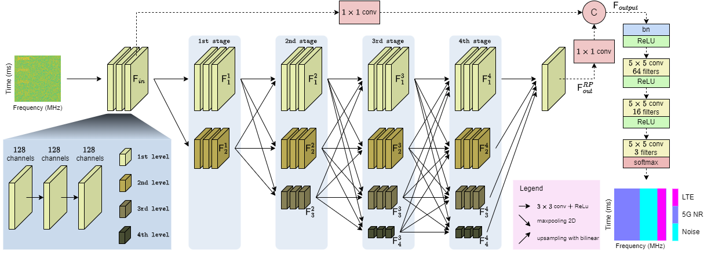

# Efficient Spectrum Sensing  for 5G-LTE Signal Identification

The advancement towards fifth-generation (5G) wireless networks and beyond has significantly heightened the demand for efficient spectrum management and utilization. Traditional spectrum sensing methods often struggle to accurately characterize spectrum occupancy, especially when multiple radio signals coexist within the same frequency band.

To address this challenge, we propose a novel spectrum sensing approach that leverages the Short-Time Fourier Transform (STFT) and neural networks to learn spectral patterns. By maintaining original resolution feature representations throughout the network architecture, we develop a semantic segmentation model, RPNet, designed to precisely detect multiple signals in the spectrum by identifying spectral content based on the occupied frequency and time domains.

RPNet preserves feature resolution across multiple processing stages and at different resolution levels, ensuring the retention of both global structures and fine-grained local details. Additionally, we introduce a novel technique called CLRu (Convolutional Layer Reuse), which optimizes the model by reusing convolutional layers within the architecture. This significantly reduces the model size and storage requirements while maintaining high segmentation accuracy, making it well-suited for deployment on resource-constrained devices.

The Python code and dataset provided here are included in the under-review paper at IEEE Transactions on Vehicular Technology.

Hai-Trang Phuoc Dang, Huu-Tai Nguyen, Quoc-Viet Pham, Van-Ca Phan, and Thien Huynh-The, "Efficient Spectrum Sensing with RPNet+CLRu: Reducing Model Size for 5G-LTE Signal Identification," IEEE TVT, 2025.

The dataset can be downloaded from [Kaggle](https://www.kaggle.com/datasets/huutai23012003/j02-tai). Please report if it is not available.

If there are any errors or topics that need to be discussed, please contact [Huu-Tai Nguyen](https://github.com/HuuTaiNg) via email at n.huutai231@gmail.com.
